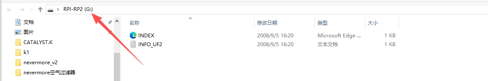
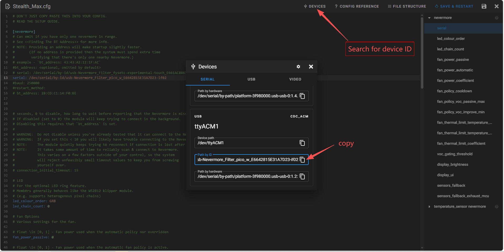
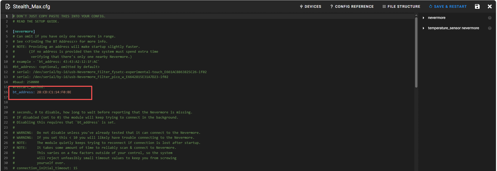
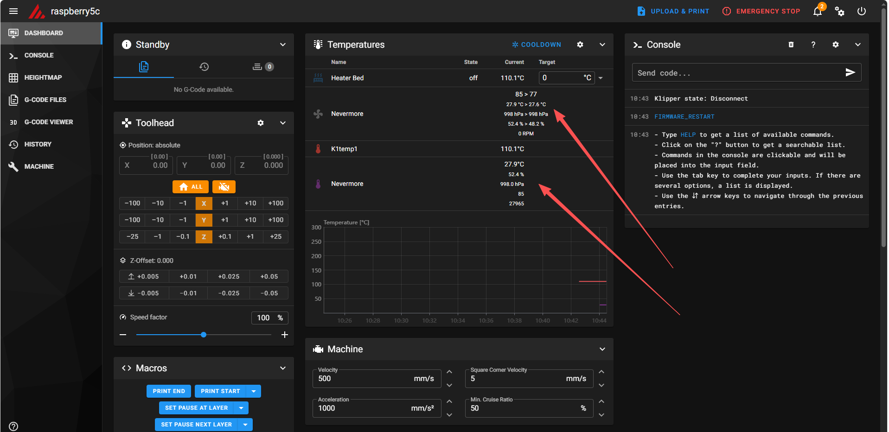

# flash fireware
* **Step 1:** \
Hold down the BOOTSEL button on the Pico W and connect it to your PC via USB; the PC will automatically open the drive folder.
<p align="center">
  
</p>

* **Step 2:** \
Copy the `picowota_ota-nevermore-controller_pico_w.uf2` firmware file to the RP1-RP2 directory. The download link for the firmware is https://github.com/SanaaHamel/nevermore-controller/releases/download/v1.0/picowota_ota-nevermore-controller_pico_w.uf2

# install nevermore
 Use the following command to install nevermore:
```shell
cd ~
git clone https://github.com/SanaaHamel/nevermore-controller
cd nevermore-controller
git fetch --all --tags
git checkout v1.0
./install-klipper-module.bash
```

# config
## id
### serial
Copy Stealth_Max.cfg to the config directory and update the Nevermore serial port ID to the one ending in 02.
<p align="center">
  
</p>

### Bluetooth
If using a Bluetooth connection, you can use the following commands on the Raspberry Pi to find the Nevermore address, and then update it in `Stealth_Max.cfg`.

```shell
bluetoothctl  # Open the interactive interface.
scan  # on Wait 5-6 seconds.
devices  # List the devices and locate the entry named "Nevermore" or "picowota".
# connect <bt_address> Optional manual connection test
```

<p align="center">
  
</p>

## state
After updating the ID and restarting Klipper, you can view the status of the Nevermore.
<p align="center">
  
</p>

# command
You can use the following test commands.

```shell
SET_FAN_SPEED FAN=nevermore_fan SPEED=0.4
SET_LED LED=nevermore RED=1 GREEN=0 BLUE=0   # Modify the value of led_chain_count in the configuration file.
NEVERMORE_VENT_SERVO_SET PERCENT=1  
NEVERMORE_VENT_SERVO_SET PERCENT=0.1 
```

